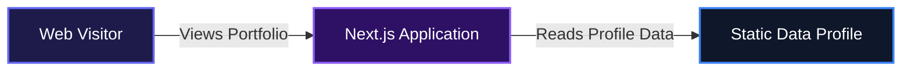
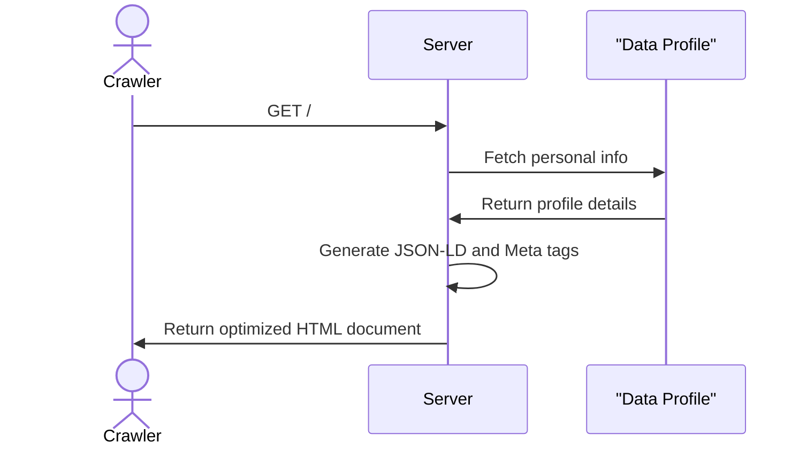

# Portfolio Three

This project serves as a digital resume and project showcase for software engineers looking to present their work professionally. It consolidates work experience, selected projects, and client testimonials into a clean, easy-to-navigate interface. Teams and developers can use this structure to build a compelling online presence without starting from scratch.

## System Architecture

Below is a high-level overview of how the application is structured.



## Usage

Users can browse through the unified single-page layout to view different sections of the professional profile. The layout features a sticky sidebar for navigation context on larger screens and a scrolling main content area.

To customize the portfolio data for a new developer profile, you need to update the central data configuration. Modify the data layer to inject custom details and previous work experience into the user interface:

```typescript
// data/portfolioData.ts
export const PERSONAL_INFO = {
  name: "Your Name",
  brand: "Your Brand",
  title: "Full-Stack Developer",
  email: "hello@example.com",
};
```

The application will automatically reflect these changes across the About section, the metadata generation for search engines, and the Contact links.

## Features

*   **Unified Profile Layout**
    The application provides a responsive two-column grid on desktop screens. A sticky sidebar keeps the core developer identity and contact links visible at all times while visitors scroll through detailed experience and project sections.

*   **Expandable Testimonials**
    To keep the interface clean, client testimonials are truncated by default. Visitors can click to expand and read the full text of any given review.

*   **Automated SEO and Metadata Generation**
    The system automatically creates a sitemap, handles robot directives, and injects structured JSON-LD data for search engines based on the personal information provided.



## Technologies Used

| Technology | Purpose |
| :--- | :--- |
| Next.js | React framework for server-side rendering and routing |
| React | UI library for building the interface components |
| TypeScript | Static typing for robust code architecture |
| Tailwind CSS | Utility-first styling and layout management |

## Author

*   LinkedIn: https://linkedin.com/in/deelolade
*   X: https://x.com/deelolade

---

[](https://www.typescriptlang.org/)
[](https://nextjs.org/)
[](https://reactjs.org/)
[](https://tailwindcss.com/)

[](https://dokugen.samueltuoyo.com)